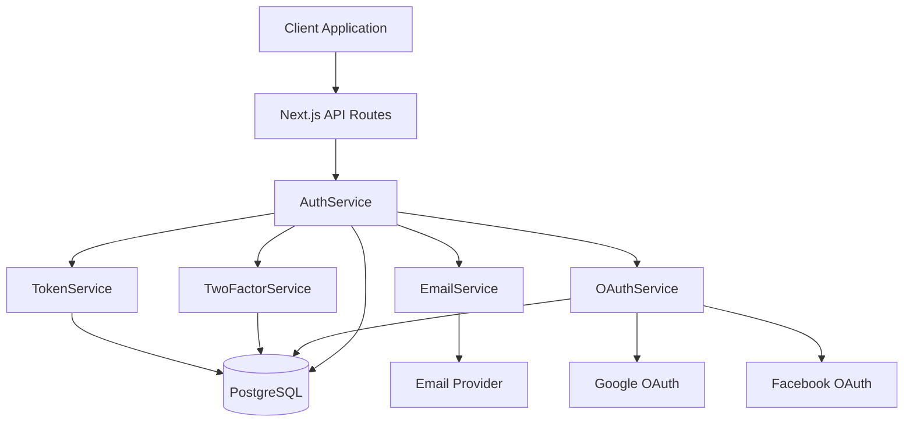

# Design Document: Advanced Authentication

## Overview

This design extends the existing authentication system for FATOS.pro with advanced features including password recovery, email verification, two-factor authentication (TOTP-based), and OAuth integration (Google and Facebook). The system maintains the existing security posture while adding enterprise-grade authentication capabilities.

### Current Architecture

The platform currently implements:
- Next.js 14 App Router with API routes
- Prisma ORM with PostgreSQL (Neon hosted)
- bcrypt password hashing (10 salt rounds)
- Session-based authentication (30-day duration, stored in database)
- Rate limiting middleware with configurable limits
- CSRF protection via security middleware
- Zod input validation with sanitization
- Existing User and Session models

### Design Goals

1. **Security First**: All tokens cryptographically secure, encrypted storage for sensitive data
2. **User Experience**: Clear feedback, graceful error handling, minimal friction
3. **Scalability**: Efficient database queries, proper indexing, token cleanup
4. **Maintainability**: Modular services, consistent patterns with existing codebase
5. **Compliance**: Audit logging for security events, 90-day retention

## Architecture

### High-Level Architecture



### Service Layer Architecture

The design follows the existing service-oriented architecture pattern:

1. **AuthService** (existing, extended)
   - Orchestrates authentication flows
   - Manages sessions and user lifecycle
   - Coordinates with new services

2. **TokenService** (new)
   - Generates cryptographically secure tokens
   - Hashes and validates tokens
   - Manages token expiration

3. **EmailService** (new)
   - Sends transactional emails
   - Handles retry logic
   - Tracks delivery status

4. **TwoFactorService** (new)
   - Generates and validates TOTP codes
   - Manages backup codes
   - Handles QR code generation

5. **OAuthService** (new)
   - Manages OAuth flows for Google and Facebook
   - Handles token exchange and refresh
   - Links OAuth accounts to users

### Technology Decisions

#### Email Service Provider: Resend

**Rationale**: 
- Modern API with excellent TypeScript support
- Generous free tier (100 emails/day, 3,000/month)
- Built for transactional emails
- Simple integration, no complex configuration
- Good deliverability rates

**Alternative Considered**: SendGrid (more complex, overkill for current needs)

#### TOTP Library: otplib

**Rationale**:
- Industry standard implementation
- Supports TOTP RFC 6238
- Works with Google Authenticator, Authy, 1Password
- Active maintenance, good TypeScript support
- Configurable time windows for clock drift

#### QR Code Generation: qrcode

**Rationale**:
- Lightweight and fast
- Supports data URLs for easy embedding
- Well-maintained, 10M+ weekly downloads
- Simple API

#### OAuth Implementation: Custom with oauth4webapi

**Rationale**:
- Full control over OAuth flows
- Better integration with existing auth system
- No vendor lock-in
- oauth4webapi provides standards-compliant primitives
- Avoids next-auth complexity and session conflicts

**Alternative Considered**: next-auth (too opinionated, conflicts with existing session management)

#### Encryption: Node.js crypto module

**Rationale**:
- Built-in, no external dependencies
- AES-256-GCM for OAuth tokens and TOTP secrets
- Secure key derivation with scrypt
- Constant-time comparison for tokens

## Components and Interfaces

### API Endpoints

#### Password Recovery

**POST /api/auth/password-reset/request**
- Body: `{ email: string }`
- Response: `{ success: true, message: string }`
- Rate limit: 3 requests per 15 minutes per IP
- Always returns success to prevent email enumeration

**POST /api/auth/password-reset/confirm**
- Body: `{ token: string, newPassword: string }`
- Response: `{ success: true }`
- Validates token, updates password, invalidates sessions

**GET /api/auth/password-reset/verify?token=xxx**
- Query: `token` (string)
- Response: `{ valid: boolean, expired: boolean }`
- Checks token validity without consuming it

#### Email Verification

**POST /api/auth/email/verify**
- Body: `{ token: string }`
- Response: `{ success: true, user: { emailVerified: boolean } }`
- Marks email as verified

**POST /api/auth/email/resend**
- Requires authentication
- Response: `{ success: true, message: string }`
- Rate limit: 3 requests per hour per user

#### Two-Factor Authentication

**POST /api/auth/2fa/setup**
- Requires authentication
- Response: `{ secret: string, qrCode: string (data URL), backupCodes: string[] }`
- Generates TOTP secret and backup codes

**POST /api/auth/2fa/confirm**
- Requires authentication
- Body: `{ code: string }`
- Response: `{ success: true, enabled: boolean }`
- Confirms 2FA setup with valid TOTP code

**POST /api/auth/2fa/verify**
- Body: `{ userId: string, code: string }`
- Response: `{ success: true, session: Session }`
- Verifies TOTP code during login

**POST /api/auth/2fa/disable**
- Requires authentication
- Body: `{ password: string }`
- Response: `{ success: true }`
- Disables 2FA after password confirmation

**POST /api/auth/2fa/backup-codes/regenerate**
- Requires authentication
- Body: `{ code: string }` (TOTP or backup code)
- Response: `{ backupCodes: string[] }`
- Generates new backup codes

#### OAuth

**GET /api/auth/oauth/[provider]/authorize**
- Provider: `google` | `facebook`
- Redirects to OAuth provider
- Includes state parameter for CSRF protection

**GET /api/auth/oauth/[provider]/callback**
- Query: `code`, `state`
- Exchanges code for tokens
- Creates/links account, creates session
- Redirects to dashboard

**POST /api/auth/oauth/link**
- Requires authentication
- Body: `{ provider: string, code: string }`
- Response: `{ success: true, linkedProviders: string[] }`
- Links OAuth account to existing user

**POST /api/auth/oauth/unlink**
- Requires authentication
- Body: `{ provider: string, password?: string }`
- Response: `{ success: true }`
- Requires password if no other auth method available

### Service Interfaces

#### TokenService

```typescript
interface TokenService {
  // Generate cryptographically secure token
  generateToken(bytes?: number): string;
  
  // Hash token for storage
  hashToken(token: string): string;
  
  // Verify token with constant-time comparison
  verifyToken(token: string, hash: string): boolean;
  
  // Create password reset token
  createPasswordResetToken(userId: string): Promise<{
    token: string;
    expiresAt: Date;
  }>;
  
  // Validate password reset token
  validatePasswordResetToken(token: string): Promise<{
    valid: boolean;
    userId?: string;
  }>;
  
  // Create email verification token
  createEmailVerificationToken(userId: string): Promise<{
    token: string;
    expiresAt: Date;
  }>;
  
  // Validate email verification token
  validateEmailVerificationToken(token: string): Promise<{
    valid: boolean;
    userId?: string;
  }>;
  
  // Cleanup expired tokens
  cleanupExpiredTokens(): Promise<void>;
}
```

#### EmailService

```typescript
interface EmailService {
  // Send password reset email
  sendPasswordResetEmail(
    to: string,
    token: string,
    language: 'ru' | 'en'
  ): Promise<void>;
  
  // Send email verification email
  sendEmailVerificationEmail(
    to: string,
    token: string,
    language: 'ru' | 'en'
  ): Promise<void>;
  
  // Send 2FA enabled notification
  send2FAEnabledEmail(
    to: string,
    language: 'ru' | 'en'
  ): Promise<void>;
  
  // Send 2FA disabled notification
  send2FADisabledEmail(
    to: string,
    language: 'ru' | 'en'
  ): Promise<void>;
}
```

#### TwoFactorService

```typescript
interface TwoFactorService {
  // Generate TOTP secret
  generateSecret(): string;
  
  // Generate QR code data URL
  generateQRCode(secret: string, email: string): Promise<string>;
  
  // Verify TOTP code (handles clock drift)
  verifyTOTP(secret: string, code: string): boolean;
  
  // Generate backup codes
  generateBackupCodes(count?: number): string[];
  
  // Hash backup code for storage
  hashBackupCode(code: string): string;
  
  // Verify backup code
  verifyBackupCode(code: string, hash: string): boolean;
  
  // Enable 2FA for user
  enable2FA(userId: string, secret: string): Promise<{
    backupCodes: string[];
  }>;
  
  // Disable 2FA for user
  disable2FA(userId: string): Promise<void>;
  
  // Verify 2FA code during login
  verify2FACode(userId: string, code: string): Promise<{
    valid: boolean;
    isBackupCode: boolean;
  }>;
  
  // Regenerate backup codes
  regenerateBackupCodes(userId: string): Promise<string[]>;
}
```

#### OAuthService

```typescript
interface OAuthService {
  // Get authorization URL
  getAuthorizationURL(
    provider: 'google' | 'facebook',
    state: string
  ): string;
  
  // Exchange authorization code for tokens
  exchangeCodeForTokens(
    provider: 'google' | 'facebook',
    code: string
  ): Promise<{
    accessToken: string;
    refreshToken?: string;
    expiresIn: number;
  }>;
  
  // Get user profile from provider
  getUserProfile(
    provider: 'google' | 'facebook',
    accessToken: string
  ): Promise<{
    id: string;
    email: string;
    name: string;
    emailVerified: boolean;
  }>;
  
  // Link OAuth account to user
  linkOAuthAccount(
    userId: string,
    provider: string,
    providerUserId: string,
    tokens: { accessToken: string; refreshToken?: string }
  ): Promise<void>;
  
  // Unlink OAuth account
  unlinkOAuthAccount(
    userId: string,
    provider: string
  ): Promise<void>;
  
  // Refresh OAuth token
  refreshOAuthToken(
    provider: 'google' | 'facebook',
    refreshToken: string
  ): Promise<{
    accessToken: string;
    expiresIn: number;
  }>;
  
  // Encrypt token for storage
  encryptToken(token: string): string;
  
  // Decrypt token from storage
  decryptToken(encrypted: string): string;
}
```

### Encryption Service

```typescript
interface EncryptionService {
  // Encrypt sensitive data (OAuth tokens, TOTP secrets)
  encrypt(plaintext: string): string;
  
  // Decrypt sensitive data
  decrypt(ciphertext: string): string;
  
  // Generate encryption key from environment variable
  deriveKey(secret: string): Buffer;
}
```

Implementation uses AES-256-GCM with:
- Random IV for each encryption
- Authentication tag for integrity
- Key derived from `ENCRYPTION_SECRET` environment variable

## Data Models

### Database Schema Changes

#### User Model Extensions

```prisma
model User {
  id                String        @id @default(cuid())
  email             String        @unique
  name              String
  passwordHash      String
  preferredLang     String        @default("ru")
  isAdmin           Boolean       @default(false)
  emailVerified     Boolean       @default(false)  // NEW
  twoFactorEnabled  Boolean       @default(false)  // NEW
  createdAt         DateTime      @default(now())
  updatedAt         DateTime      @updatedAt
  
  // Existing relations
  calculations      Calculation[]
  orders            Order[]
  adminLogs         AdminLog[]
  collectedArcana   CollectedArcana[]
  purchases         Purchase[]
  sessions          Session[]
  
  // New relations
  passwordResetTokens     PasswordResetToken[]
  emailVerificationTokens EmailVerificationToken[]
  twoFactorAuth           TwoFactorAuth?
  oauthProviders          OAuthProvider[]
  securityLogs            SecurityLog[]
  
  @@index([email])
  @@index([emailVerified])
  @@index([twoFactorEnabled])
}
```

#### PasswordResetToken Model

```prisma
model PasswordResetToken {
  id         String   @id @default(cuid())
  userId     String
  tokenHash  String   @unique
  expiresAt  DateTime
  createdAt  DateTime @default(now())
  
  user       User     @relation(fields: [userId], references: [id], onDelete: Cascade)
  
  @@index([userId])
  @@index([tokenHash])
  @@index([expiresAt])
}
```

**Design Notes**:
- `tokenHash`: SHA-256 hash of the actual token (never store plaintext)
- `expiresAt`: 1 hour from creation
- Cascade delete when user is deleted
- Index on `expiresAt` for efficient cleanup queries

#### EmailVerificationToken Model

```prisma
model EmailVerificationToken {
  id         String   @id @default(cuid())
  userId     String
  tokenHash  String   @unique
  expiresAt  DateTime
  createdAt  DateTime @default(now())
  
  user       User     @relation(fields: [userId], references: [id], onDelete: Cascade)
  
  @@index([userId])
  @@index([tokenHash])
  @@index([expiresAt])
}
```

**Design Notes**:
- `tokenHash`: SHA-256 hash of the actual token
- `expiresAt`: 24 hours from creation
- Cascade delete when user is deleted

#### TwoFactorAuth Model

```prisma
model TwoFactorAuth {
  id              String   @id @default(cuid())
  userId          String   @unique
  secretEncrypted String   // AES-256-GCM encrypted TOTP secret
  backupCodes     Json     // Array of hashed backup codes
  createdAt       DateTime @default(now())
  updatedAt       DateTime @updatedAt
  
  user            User     @relation(fields: [userId], references: [id], onDelete: Cascade)
  
  @@index([userId])
}
```

**Design Notes**:
- `secretEncrypted`: TOTP secret encrypted with AES-256-GCM
- `backupCodes`: JSON array of bcrypt-hashed backup codes
- One-to-one relationship with User
- Cascade delete when user is deleted

#### OAuthProvider Model

```prisma
model OAuthProvider {
  id                  String   @id @default(cuid())
  userId              String
  provider            String   // 'google' | 'facebook'
  providerUserId      String   // User ID from OAuth provider
  accessTokenEncrypted String  // AES-256-GCM encrypted
  refreshTokenEncrypted String? // AES-256-GCM encrypted (optional)
  expiresAt           DateTime?
  createdAt           DateTime @default(now())
  updatedAt           DateTime @updatedAt
  
  user                User     @relation(fields: [userId], references: [id], onDelete: Cascade)
  
  @@unique([provider, providerUserId])
  @@unique([userId, provider])
  @@index([userId])
  @@index([provider])
}
```

**Design Notes**:
- `provider`: Enum-like string for OAuth provider
- `providerUserId`: External user ID from OAuth provider
- Tokens encrypted with AES-256-GCM
- Unique constraint prevents duplicate OAuth links
- User can have multiple providers, but only one of each type

#### SecurityLog Model

```prisma
model SecurityLog {
  id         String   @id @default(cuid())
  userId     String?  // Nullable for failed login attempts
  event      String   // Event type (see SecurityEventType)
  ipAddress  String?
  userAgent  String?
  metadata   Json?    // Additional event-specific data
  createdAt  DateTime @default(now())
  
  user       User?    @relation(fields: [userId], references: [id], onDelete: SetNull)
  
  @@index([userId])
  @@index([event])
  @@index([createdAt])
}
```

**Security Event Types**:
- `PASSWORD_RESET_REQUESTED`
- `PASSWORD_RESET_COMPLETED`
- `EMAIL_VERIFICATION_SENT`
- `EMAIL_VERIFIED`
- `2FA_ENABLED`
- `2FA_DISABLED`
- `2FA_BACKUP_CODE_USED`
- `2FA_BACKUP_CODES_REGENERATED`
- `OAUTH_LINKED`
- `OAUTH_UNLINKED`
- `RATE_LIMIT_EXCEEDED`
- `INVALID_2FA_CODE`
- `INVALID_TOKEN`

**Design Notes**:
- Nullable `userId` for events without authenticated user
- 90-day retention policy (cleanup job)
- Metadata stores event-specific details (provider name, token type, etc.)

### Migration Strategy

1. Add new fields to User model (emailVerified, twoFactorEnabled)
2. Create new tables (PasswordResetToken, EmailVerificationToken, TwoFactorAuth, OAuthProvider, SecurityLog)
3. Add indexes for performance
4. Set default values for existing users (emailVerified=false, twoFactorEnabled=false)
5. No data migration needed (new features, no existing data)

## Error Handling

### Error Types and Responses

#### Token Errors

```typescript
class TokenExpiredError extends Error {
  constructor() {
    super('Token has expired');
    this.name = 'TokenExpiredError';
  }
}

class TokenInvalidError extends Error {
  constructor() {
    super('Token is invalid');
    this.name = 'TokenInvalidError';
  }
}

class TokenAlreadyUsedError extends Error {
  constructor() {
    super('Token has already been used');
    this.name = 'TokenAlreadyUsedError';
  }
}
```

**HTTP Response**: 400 Bad Request with specific error message

#### 2FA Errors

```typescript
class TwoFactorNotEnabledError extends Error {
  constructor() {
    super('Two-factor authentication is not enabled');
    this.name = 'TwoFactorNotEnabledError';
  }
}

class TwoFactorCodeInvalidError extends Error {
  constructor() {
    super('Invalid two-factor authentication code');
    this.name = 'TwoFactorCodeInvalidError';
  }
}

class TwoFactorSetupIncompleteError extends Error {
  constructor() {
    super('Two-factor authentication setup is incomplete');
    this.name = 'TwoFactorSetupIncompleteError';
  }
}
```

**HTTP Response**: 401 Unauthorized for invalid codes, 400 Bad Request for setup errors

#### OAuth Errors

```typescript
class OAuthStateInvalidError extends Error {
  constructor() {
    super('Invalid OAuth state parameter');
    this.name = 'OAuthStateInvalidError';
  }
}

class OAuthProviderError extends Error {
  constructor(provider: string, message: string) {
    super(`OAuth error from ${provider}: ${message}`);
    this.name = 'OAuthProviderError';
  }
}

class OAuthAccountAlreadyLinkedError extends Error {
  constructor(provider: string) {
    super(`This ${provider} account is already linked to another user`);
    this.name = 'OAuthAccountAlreadyLinkedError';
  }
}
```

**HTTP Response**: 400 Bad Request with user-friendly message

#### Rate Limit Errors

```typescript
class RateLimitExceededError extends Error {
  constructor(public retryAfter: number) {
    super('Rate limit exceeded');
    this.name = 'RateLimitExceededError';
  }
}
```

**HTTP Response**: 429 Too Many Requests with `Retry-After` header

### Error Handling Strategy

1. **Validation Errors**: Caught at API route level, return 400 with field-specific errors
2. **Authentication Errors**: Return 401 with generic message (prevent information leakage)
3. **Authorization Errors**: Return 403 when user lacks permission
4. **Rate Limit Errors**: Return 429 with retry-after header
5. **Server Errors**: Log full error, return 500 with generic message
6. **Email Errors**: Log error, retry up to 3 times, then fail gracefully

### Logging Strategy

```typescript
interface ErrorLog {
  timestamp: Date;
  level: 'error' | 'warn' | 'info';
  service: string;
  error: {
    name: string;
    message: string;
    stack?: string;
  };
  context: {
    userId?: string;
    endpoint?: string;
    ipAddress?: string;
  };
}
```

- All errors logged with context
- PII sanitized from logs
- Stack traces only in development
- Security events logged to SecurityLog table
- Application errors logged to console (captured by hosting platform)

## Testing Strategy

### Unit Testing

Unit tests focus on specific examples, edge cases, and error conditions. Property-based tests handle comprehensive input coverage.

#### TokenService Tests

- Token generation produces URL-safe strings
- Token hashing is deterministic
- Token verification uses constant-time comparison
- Expired tokens are rejected
- Invalid tokens are rejected
- Token cleanup removes only expired tokens

#### EmailService Tests

- Email templates render correctly for both languages
- Retry logic attempts up to 3 times
- Failed emails are logged
- Email links contain valid tokens

#### TwoFactorService Tests

- TOTP codes are 6 digits
- QR codes contain correct URI format
- Backup codes are unique and properly formatted
- Clock drift tolerance (±1 time window)
- Backup code consumption prevents reuse

#### OAuthService Tests

- Authorization URLs contain required parameters
- State parameter prevents CSRF
- Token encryption/decryption round-trips correctly
- Provider-specific profile parsing
- Token refresh updates access token

#### AuthService Tests (Extended)

- Password reset flow completes successfully
- Email verification marks user as verified
- 2FA login requires TOTP code
- OAuth login creates or links account
- Session invalidation on password change

### Property-Based Testing

Property-based tests verify universal properties across all inputs using the `fast-check` library (already in dependencies). Each test runs minimum 100 iterations.

**Configuration**:
```typescript
import fc from 'fast-check';

// Run each property test 100 times
fc.assert(property, { numRuns: 100 });
```

**Test Tagging**:
Each property test includes a comment referencing the design property:
```typescript
// Feature: advanced-authentication, Property 1: Token generation produces unique values
```

### Integration Testing

- Full password reset flow (request → email → confirm)
- Full email verification flow (register → email → verify)
- Full 2FA setup flow (generate → confirm → login)
- Full OAuth flow (authorize → callback → session)
- Rate limiting enforcement across endpoints
- Session management with 2FA enabled

### Security Testing

- Token timing attack resistance (constant-time comparison)
- CSRF protection on OAuth flows
- Rate limiting prevents brute force
- Encrypted data cannot be decrypted without key
- SQL injection prevention (Prisma parameterized queries)
- XSS prevention (input sanitization)

### Test Environment

- Jest for test runner
- fast-check for property-based testing
- Prisma test database (separate from development)
- Mock email service (no actual emails sent)
- Mock OAuth providers (test credentials)


## Correctness Properties

*A property is a characteristic or behavior that should hold true across all valid executions of a system—essentially, a formal statement about what the system should do. Properties serve as the bridge between human-readable specifications and machine-verifiable correctness guarantees.*

### Property 1: Token Generation Security

*For any* security token (password reset or email verification), the generated token SHALL contain at least 32 bytes of cryptographically secure random data and be URL-safe encoded.

**Validates: Requirements 1.6, 14.1, 14.5**

### Property 2: Token Storage Security

*For any* security token stored in the database, the system SHALL store only the SHA-256 hash of the token, never the plaintext value.

**Validates: Requirements 1.2, 3.2, 14.2**

### Property 3: Token Expiration Validation

*For any* security token validation attempt, the system SHALL reject the token if the current time exceeds the expiration timestamp, regardless of whether the token hash matches.

**Validates: Requirements 2.1, 2.5, 14.4**

### Property 4: Token Single-Use Enforcement

*For any* security token that is successfully used, the system SHALL invalidate that token such that subsequent attempts to use the same token fail.

**Validates: Requirements 2.4, 2.6**

### Property 5: Password Reset Session Invalidation

*For any* successful password reset, the system SHALL invalidate all existing sessions for that user except the current session (if any).

**Validates: Requirements 2.3, 18.2**

### Property 6: Password Security Requirements

*For any* password submitted during registration or password reset, the system SHALL validate that it contains at least 8 characters before accepting it.

**Validates: Requirements 2.7, 17.2**

### Property 7: Email Enumeration Prevention

*For any* password reset request with an email address (whether it exists in the system or not), the system SHALL return the same generic success response.

**Validates: Requirements 1.4**

### Property 8: Email Verification Status Update

*For any* valid email verification token that is successfully used, the system SHALL set the user's emailVerified field to true.

**Validates: Requirements 3.4**

### Property 9: TOTP Secret Uniqueness

*For any* two 2FA setup operations, the generated TOTP secrets SHALL be unique (collision probability negligible).

**Validates: Requirements 5.1**

### Property 10: TOTP Secret Encryption

*For any* TOTP secret stored in the database, the system SHALL store it in encrypted form using AES-256-GCM, not plaintext.

**Validates: Requirements 5.6**

### Property 11: Backup Code Generation

*For any* successful 2FA setup, the system SHALL generate exactly 10 unique backup codes.

**Validates: Requirements 5.4**

### Property 12: Backup Code Storage Security

*For any* backup code stored in the database, the system SHALL store only the bcrypt hash of the code, never the plaintext value.

**Validates: Requirements 5.7**

### Property 13: TOTP Code Format

*For any* TOTP code generated by the system, the code SHALL be exactly 6 digits.

**Validates: Requirements 5.8**

### Property 14: TOTP Clock Drift Tolerance

*For any* TOTP code validation, the system SHALL accept codes from the current 30-second time window and the immediately previous time window.

**Validates: Requirements 6.5**

### Property 15: 2FA Login Flow

*For any* user with 2FA enabled who submits valid credentials, the system SHALL NOT create a session until a valid TOTP code or backup code is provided.

**Validates: Requirements 6.1**

### Property 16: Backup Code Consumption

*For any* backup code that is successfully used for authentication, the system SHALL mark it as consumed such that subsequent attempts to use the same code fail.

**Validates: Requirements 6.6, 6.7**

### Property 17: 2FA Disable Cleanup

*For any* successful 2FA disable operation, the system SHALL delete the TOTP secret and all backup codes from the database.

**Validates: Requirements 7.2**

### Property 18: Backup Code Regeneration Invalidation

*For any* backup code regeneration operation, the system SHALL invalidate all previously generated backup codes such that they can no longer be used for authentication.

**Validates: Requirements 7.4**

### Property 19: 2FA Enable Session Invalidation

*For any* successful 2FA enable operation, the system SHALL invalidate all existing sessions for that user and require re-authentication.

**Validates: Requirements 18.1**

### Property 20: OAuth Provider Redirect

*For any* OAuth login initiation (Google or Facebook), the system SHALL generate a redirect URL to the provider's authorization endpoint with a cryptographically secure state parameter.

**Validates: Requirements 9.1, 10.1, 12.4**

### Property 21: OAuth Token Exchange

*For any* valid OAuth authorization code received from a provider, the system SHALL exchange it for an access token by making a request to the provider's token endpoint.

**Validates: Requirements 9.2, 10.2**

### Property 22: OAuth Account Creation

*For any* first-time OAuth login where the email does not exist in the system, the system SHALL create a new user account with emailVerified set to true.

**Validates: Requirements 9.4, 9.9, 10.4, 10.8**

### Property 23: OAuth Account Linking

*For any* OAuth login where the email matches an existing account, the system SHALL link the OAuth provider to that existing account rather than creating a duplicate.

**Validates: Requirements 9.5, 10.5, 11.2**

### Property 24: OAuth Token Encryption

*For any* OAuth access token or refresh token stored in the database, the system SHALL store it in encrypted form using AES-256-GCM, not plaintext.

**Validates: Requirements 9.7, 10.7, 12.1**

### Property 25: OAuth Duplicate Link Prevention

*For any* attempt to link an OAuth account that is already linked to a different user, the system SHALL reject the operation with an error.

**Validates: Requirements 11.3**

### Property 26: OAuth Session Preservation

*For any* successful OAuth account linking operation, the system SHALL NOT invalidate the user's existing sessions.

**Validates: Requirements 18.3**

### Property 27: Email Retry Logic

*For any* email send operation that fails, the system SHALL retry up to 3 times before marking the operation as failed.

**Validates: Requirements 13.3**

### Property 28: Transactional Email Unsubscribe Exclusion

*For any* transactional email (password reset, email verification, 2FA notifications), the system SHALL NOT include an unsubscribe link.

**Validates: Requirements 13.5**

### Property 29: Token Constant-Time Comparison

*For any* security token validation, the system SHALL use constant-time comparison to prevent timing attacks.

**Validates: Requirements 14.3**

### Property 30: Rate Limit Response Format

*For any* request that exceeds rate limits, the system SHALL return HTTP 429 status code with a Retry-After header indicating when the client can retry.

**Validates: Requirements 15.5**

### Property 31: Rate Limit Sliding Window

*For any* rate-limited endpoint, the system SHALL use a sliding window algorithm such that burst requests within the time window are blocked.

**Validates: Requirements 15.6**

### Property 32: Security Event Logging

*For any* security-sensitive operation (password reset, password change, 2FA enable/disable, OAuth link/unlink, backup code usage, rate limit violation), the system SHALL create a log entry with timestamp, user ID (if applicable), and relevant metadata.

**Validates: Requirements 16.1, 16.2, 16.3, 16.4, 16.5, 16.6**

### Property 33: Audit Log Retention

*For any* security log entry older than 90 days, the system's cleanup process SHALL remove it from the database.

**Validates: Requirements 16.7**

### Property 34: Input Validation

*For any* user input (email, password, TOTP code, backup code), the system SHALL validate it against the expected format using Zod schemas before processing.

**Validates: Requirements 17.1, 17.2, 17.3, 17.4**

### Property 35: Log Injection Prevention

*For any* user input that is logged, the system SHALL sanitize it to remove newlines and control characters that could enable log injection attacks.

**Validates: Requirements 17.5**

### Property 36: Validation Error Messages

*For any* validation failure, the system SHALL return a descriptive error message that does not expose system internals (database structure, file paths, etc.).

**Validates: Requirements 17.6**

### Property 37: Session Duration Consistency

*For any* successful authentication (password, 2FA, or OAuth), the system SHALL create a session with a 30-day expiration from the time of creation.

**Validates: Requirements 18.5**

### Property 38: User Feedback Completeness

*For any* authentication operation (password reset request, email verification, 2FA setup, OAuth login), the system SHALL return a response with clear feedback about the operation status and next steps.

**Validates: Requirements 19.1, 19.2, 19.3, 19.4, 19.5**

### Property 39: Token Cleanup

*For any* expired token (password reset or email verification), the system's cleanup process SHALL remove it from the database within 24 hours of expiration.

**Validates: Requirements 20.7**

### Property 40: Encryption Round-Trip

*For any* sensitive data (OAuth tokens, TOTP secrets) that is encrypted and then decrypted, the decrypted value SHALL equal the original plaintext value.

**Validates: Requirements 5.6, 9.7, 10.7, 12.1**

